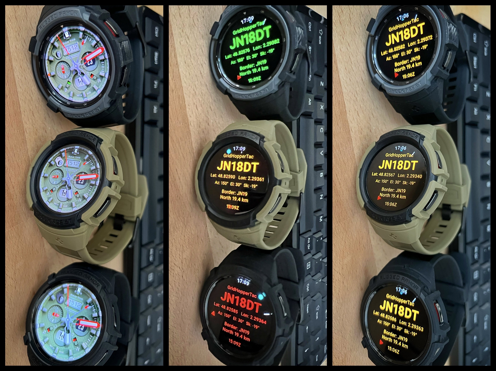

## GridHopperTac

A wearable geo satellite roving companion for portable operators.

GridHopperTac runs completely autonomously and independently on a smart watch. It is not linked to or indeed need a cellphone to function.

## Features

- Live Maidenhead locator display (6-character)
- Grid crossing (Border-X) alerts
- Cooldown timer (avoids alarm toggling when weaving along a grid line)
- Audible/Vibration alerts (Selectable sounds)
- Alert repetitions
- Maidenhead border prediction (distance and direction)
- Configurable geo satellite orbital position
- Geostationary satellite pointing data (Azimuth / Elevation / Skew)
- Geostationary satellite pointing compass (Cyan dot)
- Compass North (red arrow) and South (reference) markers
- Shows True North (corrected for magnetic declination)
- Rover Mode (always-on)
- Compass enable/disable (battery saving)
- Display colour variants (Contrast, CRT, Night, Avionic)
- Display modes: default System, Always On and auto-dim Ghost
- Field-friendly display optimised for portable operation
- UTC and Local time display
- Real-time GPS positioning
- Autonomous operation, with no internet access required
- Independant operation, without the need of a cellphone 

## Status

- Beta testing
- Preliminary release for field testing by amateur radio operators

## Notes
GridHopperTac is a lightweight standalone version of GridHopper.net, but for Wear OS devices.
It provides the most essential features of the original GridHopper.net web app in a very lightweight package. 

Field tested on a Samsung Galaxy Watch 4 Classic w/display 46mm, 450x450. 
Running well on a Watch 5 Pro also. Other similar sized displays should work also.

Install by sideloading the APK to a Wear OS watch using Android Studio, ADB, or other compatible APK installation tools.
Try Malcolm's 'Wear Installer 2' to sideload the APK. He details the connection and pairing procedure. 
Can be very slow to load (5 mins), but on reaching 100% 'Error:' message should show empty. 

Quick Start: Click top of screen [GridHopperTac] to enter Options page. Scroll down and click [BACK] to return.
Click each option to cycle/increment value. For orbital position, a long press will jump by 10 degrees to save time.

73
F5VMJ

## Download

[Download GridHopperTac v0.5 Beta APK] 

https://drive.google.com/file/d/1EgDm9JmE50azggaM8iE8UEHcqxSTyF9g/view?usp=sharing

## Demo Video

Click the image above to watch the demo video.

<h2>Screenshots</h2>

  

  

