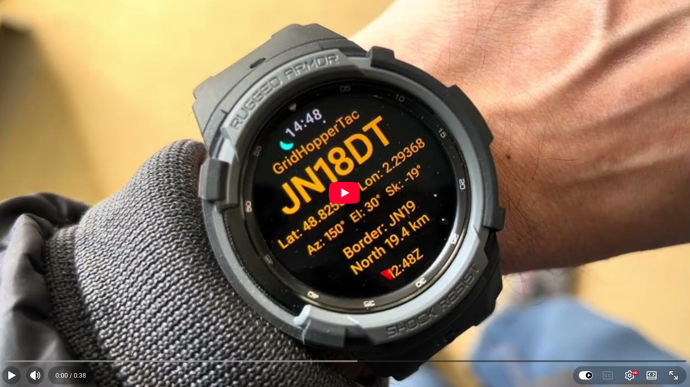
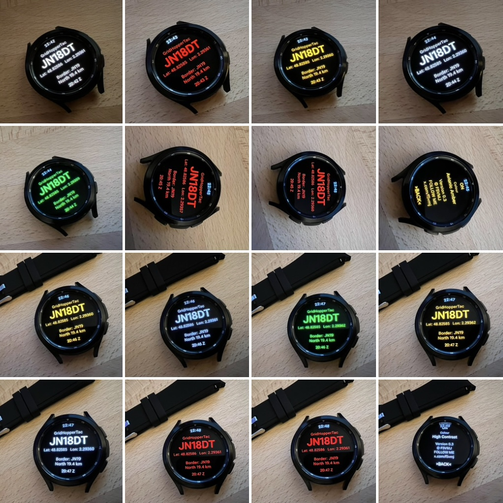

## GridHopperTac v0.3 Beta

Wearable geo satellite roving companion for portable operators

## Features

- Live Maidenhead locator display (6-character)
- Grid crossing (Border-X) alerts
- Audible/Vibration alerts (Selectable sounds)
- Alert repetitions
- Maidenhead border prediction (distance and direction)
- Configurable geo satellite orbital position
- Geostationary satellite pointing data (Azimuth / Elevation / Skew)
- Geostationary satellite pointing compass (Cyan dot)
- Compass North (red arrow) and South (reference) markers
- Rover Mode (always-on display)
- Compass enable/disable (battery saving)
- Display colour variants (Contrast, CRT, Night, Avionic)
- Field-friendly display optimised for portable operation
- UTC and Local time display
- Real-time GPS positioning
- Autonomous operation (no internet access required)

## Status

- Beta testing
- Preliminary release for field testing by amateur radio operators

## Notes
GridHopperTac is a lightweight standalone version of GridHopper.net, but for Wear OS devices.
It provides the most essential features of the original GridHopper.net web app in a very lightweight package. 

Currently running on a Samsung Galaxy Watch 4 Classic w/display 46mm, 450x450. Other versions will work depending on size.
Install by sideloading the APK to a Wear OS watch using Android Studio, ADB, or other compatible APK installation tools.

Quick Start: Click top of screen [GridHopperTac] to enter Options page. Scroll down and click [BACK] to return.
Click each option to cycle/increment value. For orbital position, a long press will jump by 10 degrees to save time.

73
F5VMJ

## Download

[Download GridHopperTac v0.3 Beta APK] 
https://drive.google.com/file/d/13mijxRoSovaxq0RwQ2p4ihYJZZb9fDDi/view?usp=drive_link

## Demo Video

Click the image above to watch the demo video.

<h2>Screenshots</h2>

  

