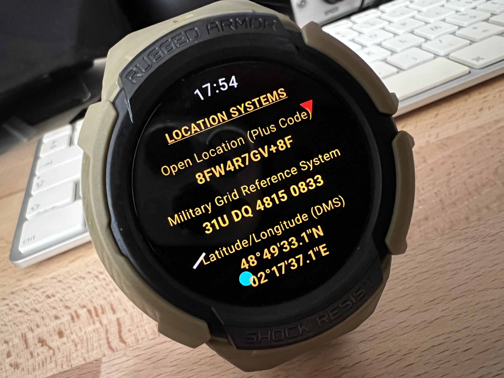

## GridHopperTac

A wearable geo satellite roving companion for portable operators.

GridHopperTac runs completely autonomously and independently on a smart watch. It is not linked to or indeed need a cellphone to function.

## Features

- Live Maidenhead locator display (6-character)
- Grid crossing (Border-X) alerts
- Cooldown timer (avoids alarm toggling when weaving along a grid line)
- Audible/Vibration alerts (Selectable sounds)
- Alert repetitions
- Maidenhead border prediction (distance and direction)
- Configurable geo satellite orbital position
- Geostationary satellite pointing data (Azimuth / Elevation / Skew)
- Geostationary satellite pointing compass (Cyan dot)
- Compass North (red arrow) and South (reference) markers
- Shows True North (corrected for magnetic declination)
- Rover Mode (always-on)
- Display colour variants (Contrast, CRT, Night, Avionic)
- Display modes: default System, Always On and auto-dim Ghost
- Field-friendly display optimised for portable operation
- Location reference include DMS, DDM, Plus Codes and Military Grid Reference System.
- Real-time GPS positioning
- Completely offline gridline map page.
- Purpose-built lightweight world vector map format.
- Rotating-bezel zoom on compatible watches.
  
- Autonomous operation, with no internet access required
- Independent operation, without the need of a cellphone 

## Status

- New Version 7beta (w/ Maidenhead grid map).
- Beta released 22/08/26 for full field testing.

## Notes
GridHopperTac is a lightweight standalone version of GridHopper.net, but for Wear OS devices.
It provides the most essential features of the original GridHopper.net web app in a very lightweight package. 

Field tested on a Samsung Galaxy Watch 4 Classic w/display 46mm, 450x450. 
Running well on a Watch 5 Pro and Watch 6 Classic also. Other WearOS watches with similarly sized displays should work also.

Install by sideloading the APK to a Wear OS watch using Android Studio, ADB, or other compatible APK installation tools.
Try Malcolm's 'Wear Installer 2' to sideload the APK. He details the connection and pairing procedure. 
Can be very slow to load (5 mins) but loads without incident.

Quick Start: 
To cycle through pages: MAIN > MAP > LOCATION SYSTEMS, use long press on screen.
To Zoom in/out on MAP, tap lower/upper half of map screen, or use rotating bezel if available.
Click top of MAIN screen on [GridHopperTac], to enter OPTIONS page. Scroll down and click [eXit] to return.
Tap each option to cycle/increment value. For orbital position, a long press will jump by 10 degrees to save time.

73
F5VMJ

Disclaimer: GridHopperTac is provided for situational awareness only. It is not a certified navigation aid and must not be relied upon for safety-critical navigation.

**Also available:** **[GridHopper](https://gridhopper.net)**, the companion web application. Accessible from any modern web browser, it provides advanced mapping, location reference systems, and many additional tools. Handy for portable, mobile, and roving operations with iPhone or Android.

## Download

Latest release.
[Download GridHopperTac v0.6 APK] 

[Download GridHopperTac v0.6 APK] 
https://drive.google.com/file/d/1pm5zu0N4VlR4luYy550q6T3Lf_3uVjw5/view?usp=sharing

## What's New

Version 0.7b
- Big update:
  New offline map page available.
  World purpose built gridline vector chart format.
  Zoom in/out with rotating bezel also available..

- Miles and Nautical Miles added.
- Latitude/Longitude DMS and DDS added.
  
  

Version 0.6
- New Display Modes for battery saving and discretion:
  - System
  - Always-On
  - Ghost (auto-dimming)

- Improved True-North compass smoothing.
- Magnetic declination shown in About section.
- General performance improvements.

- Added page to view other location reference systems: 
  Lat/Lon in DMS, Plus Codes (Open Location Code) and Military Grid Reference System (MGRS).

## Demo Video

Click the image above to watch the demo video.

<h2>Screenshots</h2>

  

  

  

